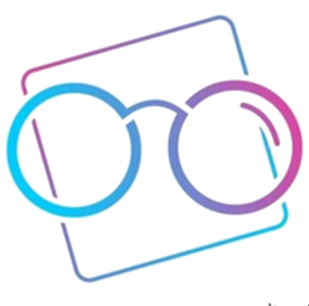

# OpenGlass: Showcase yourself through your work

> OpenGlass is a web app with the primary goal of serving as an application showcase platform where developers can exhibit their work and receive feedback from others via comments, likes, and contribution prospects.

## FEATURE LIST OVERVIEW
- [X] 1. Main Page: Search/Filter projects based on technologies.
- [X] 2. Post Project: Authenticated users can add projects as per the defined schema.
- [X] 3. My projects: Allows users to retrieve their project(s).
- [X] 4. Individual project page:Displays details for the selected project and show relevant outline of information.
- [X] 5. User Profile page:Displays the user’s project and other details.
- [X] 6. Saved projects:Displays all the project(s) saved/bookmarked by the user.
- [X] 7. Portfolio:Turn the Profile-Pageinto an portfolio website with an option to upload the resume.
- [X] 8. Idea section: Post project ideas and allow contributors.
- [X] 9. Edit/Delete project:Authenticated users can modify/delete their project(s).
- [X] 10. Interaction:Authenticated users can Upvote/Comment on any project or Save/Bookmark them.

## TECHNOLOGY STACK
THis application is built using [`MERN`](https://www.mongodb.com/mern-stack) stacks


- [`MongoDB`](https://www.mongodb.com/) - DATABASE
- [`Express`](https://www.mongodb.com/) - SERVER
- [`React`](https://www.mongodb.com/) - WEB
- [`Node`](https://www.mongodb.com/) - SERVER

## DATABASE SCHEMA IN USE
> Users Collection
```js
{
   "_id":"638a922d97cd9732b83106a8",
   "firstName":"Nikunj",
   "lastName":"Sharma",
   "username":"nik",
   "dob":"03-05-1970",
   "bio":null,
   "location":"New Jersey",
   "email":"nik@gmail.com",
   "password":"$2b$16$bZhR5L",
   "education":[
      {
         "_id":"7b7997a2-c0d2-4f8c-b27a-6a1d4b5b620",
         "school":"Stevens Institute of Technology",
         "course":"MS in Computer Science",
         "from":"08/12/2018",
         "to":"08/24/2020",
         "isCurrent":false
      }
   ],
   "skills":[
      
   ],
   "experience":[
      {
         "_id":"7b7997a2-c0d2-4f8c-b27a-6a1d4b5b610",
         "company":"Google",
         "position":"Software Developer Engineer",
         "from":"09/12/2020",
         "to":"10/19/2021",
         "isCurrent":false
      }
   ],
   "socials":{
      "github":"https://github.com/199nik/test.git",
      "linkedin":null
   }
}
```
> Projects Collection
```js
{
   "_id":"639181477a14df2ee3ee937a",
   "name":"Aftersell Casestudy 3D illustration",
   "description":"Description here",
   "github":"https://github.com/199nik/test.git",
   "media":[
      
   ],
   "deploymentLink":"www.github.com",
   "createdAt":"2022-12-08T06:16:39.174Z",
   "updatedAt":"2022-12-08T06:16:39.174Z",
   "technologies":[
      "Python",
      "Flask",
      "Algorithm"
   ],
   "owner":{
      "_id":"638a922d97cd9732b83106a8",
      "username":"nik"
   },
   "savedBy":[
      "638a922d97cd9732b83106a8",
      "639182577a14df2ee3ee937c"
   ],
   "comments":[
      {
         "_id":"639182237a14df2ee3ee937b",
         "comment":"Nice! This is awesome",
         "timestamp":"2022-12-08T06:20:19.508Z",
         "owner":{
            "_id":"638a922d97cd9732b83106a8",
            "username":"nik"
         }
      }
   ],
   "likes":[
      "639183fc7a14df2ee3ee937ft",
      "1245e83fc7a14df2ee1d2xcvt"
   ]
}
```

> Idea Collection
```js
{
   "_id":"638aaab41cdca2fb05c054f5",
   "name":"CV Generator -NEW",
   "description":"Responsive Portfolio Website",
   "status":"active",
   "lookingFor":2,
   "createdAt":"2022-12-03T01:47:32.083Z",
   "technologies":[
      "HTML",
      "ReactJS"
   ],
   "owner":{
      "_id":"638a922d97cd9732b83106a8",
      "username":"nik"
   },
   "comments":[
      {
         "_id":"639182237a14df2ee3ee937b",
         "comment":"Nice! This is awesome",
         "timestamp":"2022-12-08T06:20:19.508Z",
         "owner":{
            "_id":"638a922d97cd9732b83106a8",
            "username":"nik"
         }
      }
   ],
   "likes":[
      "639183fc7a14df2ee3ee937ft",
      "1245e83fc7a14df2ee1d2xcvt"
   ],
   "updatedAt":"2022-12-03T03:09:37.879Z"
}
```

## REST API(s)


## Setup

### Clone from git repository
```
URL: https://github.com/khatri7/cs546-group36-final-project.git
```

### INstalling dependencies

Install npm dependencies in both the `client` and `server` subdirectories and also the root directory using `npm install`.

```shell
> npm install
> cd server && npm install
> cd client && npm install
```

The root directory has been initialized as an npm project and installs [`concurrently`](https://www.npmjs.com/package/concurrently) as a dev dependency to start both the client and the server with a single command

Set up a MongoDB database either locally or online via <a href='https://www.mongodb.com/cloud/atlas'>MongoDB Atlas</a>

Create a `.env` file in both the `client` and `server` subdirectories as shown in the `.env.example` files

Set up the following environment variables

> In `client/.env`:

```js
REACT_APP_SERVER_URL=http://localhost:3005/
```

> In `server/.env`:

```js
MONGO_URL= //MongoDB database endpoint
MONGO_DATABASE= //name of the database
```

### Run

Finally, to run the code, from the root directory you can start the application using:

```shell
$ npm run dev
```

## The Team
- [`Abhishek Khatri`](https://github.com/khatri7)
- [`Giri Yogendra`](https://github.com/GiriNithin)
- [`Nihal Sanjay Palled`](https://github.com/nihalpalled)
- [`Nikunj Sharma`](https://github.com/1994nikunj)
- [`Sabitha Rachel Nazareth`](https://github.com/sabithanazareth)
